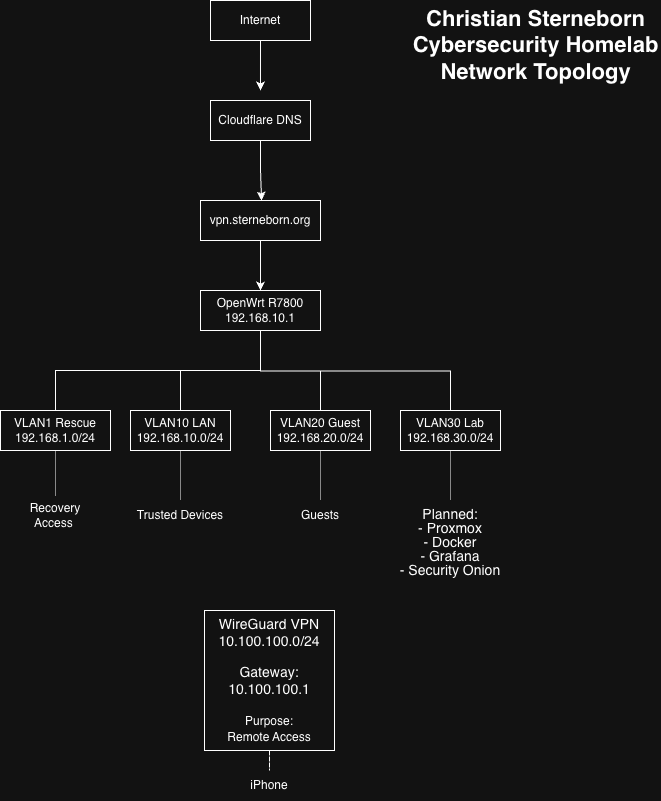

# Cybersecurity Homelab

A structured, active homelab for practical IT support, networking, infrastructure, and cybersecurity learning. The work emphasizes implementation, methodical troubleshooting, validation, operations, and clear technical documentation.

The current environment uses UniFi networking and Proxmox virtualization. The repository also preserves the earlier OpenWrt architecture as project history.

## Current Environment

### Network and Remote Access

* UniFi Cloud Gateway Ultra and UniFi U7 Lite access point
* Five segmented networks: VLAN 10 Trusted, VLAN 20 Guest, VLAN 30 Lab / Servers, VLAN 40 IoT, and VLAN 50 Remote Access
* UniFi zone-based firewall policies and host-level firewall restrictions
* Twingate resource-based Zero Trust access through a dedicated Debian LXC Connector in VLAN 50
* WireGuard as a separate, established tunnel- and routing-based VPN path

Remote clients do not join VLAN 50. The VLAN isolates the Twingate Connector, which initiates outbound connections and reaches only approved internal resources through explicit policy layers.

### Virtualization, Services, and Automation

* Proxmox VE and Ubuntu Server
* Docker and Portainer
* Home Assistant and AdGuard Home
* Uptime Kuma and SmokePing
* Prometheus, Node Exporter, and Grafana
* n8n workflow automation

### Custom Projects

* **Knut** — a custom AI and automation project
* **Borgen Audio** — Raspberry Pi 4 with Raspberry Pi DAC Pro, AirPlay through Shairport Sync, and Android Bluetooth audio through BlueALSA
* **Zigbee2MQTT** — planned Zigbee coordinator, MQTT broker, and Home Assistant architecture

## Current Network Topology

## Network Segmentation

| VLAN | Network | Purpose |
| ---: | ------- | ------- |
| 10 | Trusted | Personal and administrative clients |
| 20 | Guest | Isolated visitor access |
| 30 | Lab / Servers | Proxmox, VMs, containers, and infrastructure services |
| 40 | IoT | Smart-home and lower-trust devices |
| 50 | Remote Access | Dedicated Twingate Connector security segment |

Inter-network access is controlled with zone-based firewall policies and explicit exceptions. Host firewalls add service-level restrictions where required.

## Hardware

### Network

* UniFi Cloud Gateway Ultra
* UniFi U7 Lite access point

### Virtualization Server

* Fujitsu Esprimo Q7010
* Intel Core i5-10400T
* 32 GB RAM
* 256 GB NVMe SSD
* 1 TB external SSD

### Audio Project

* Raspberry Pi 4
* Raspberry Pi DAC Pro

## Architecture History

The first segmented homelab network ran on a Netgear R7800 with OpenWrt 24.10. It provided hands-on experience with VLANs, firewall zones, WireGuard, Cloudflare Dynamic DNS, DHCP/DNS integration, Wi-Fi configuration, and systematic network troubleshooting.

That architecture was later migrated to UniFi. The old topology, screenshots, configuration notes, and journal entries remain as evidence of the earlier implementation and the learning that informed the current design.

## Documentation

The MkDocs source lives in [`documentation/`](documentation/), and generated site output is written to [`docs/`](docs/).

### Network

* [Network Overview](documentation/Network-Overview.md)
* [UniFi Network](documentation/Network/UniFi.md)
* [VLAN Segmentation](documentation/Network/VLANs.md)
* [Twingate Zero Trust Access](documentation/Network/Twingate.md)
* [WireGuard Remote Access](documentation/Network/WireGuard.md)
* [Cloudflare DDNS](documentation/Network/Cloudflare-DDNS.md)
* [OpenWrt — Previous Architecture](documentation/Network/OpenWrt.md)

### Virtualization

* [Proxmox](documentation/Virtualization/Proxmox.md)
* [Virtual Networking](documentation/Virtualization/Virtual-Networking.md)
* [Backup Strategy](documentation/Virtualization/Backup-Strategy.md)

### Services

* [Home Assistant](documentation/Services/Home-Assistant.md)
* [Docker](documentation/Services/Docker.md)
* [Portainer](documentation/Services/Portainer.md)
* [AdGuard Home](documentation/Services/AdGuard-Home.md)
* [Uptime Kuma](documentation/Services/Uptime-Kuma.md)
* [Prometheus](documentation/Services/Prometheus.md)
* [Grafana](documentation/Services/Grafana.md)

### Security and Projects

* [Security Practices](documentation/Security/Security-Practices.md)
* [Knut AI & Automation](documentation/Projects/Knut.md)
* [Borgen Audio](documentation/Projects/Borgen-Audio.md)
* [Planned Zigbee2MQTT Architecture](documentation/Projects/Zigbee2MQTT.md)

### Project Tracking

* [Project Journal](documentation/Project-Journal.md)
* [Learning Methodology](documentation/Career/Learning-Methodology.md)

## Troubleshooting Philosophy

1. Define the problem and expected behavior.
2. Collect evidence from the client, network, host, and application layers.
3. Form and test one hypothesis at a time.
4. Make a controlled change.
5. Verify the result and recovery path.
6. Document the outcome and lessons learned.

## Security Practices

The environment uses segmentation, zone-based and host-level firewalls, least-privilege exceptions, separate remote-access models, tested backup workflows, and careful handling of public evidence. Credential hygiene is supported through Bitwarden-based password management, unique credentials, and keeping secrets outside the public repository.

## Roadmap

### Operating

* [x] UniFi gateway and managed Wi-Fi
* [x] Five VLAN segments and zone-based firewall policies
* [x] Twingate Zero Trust access
* [x] WireGuard VPN
* [x] Proxmox, Docker, and core services
* [x] Prometheus, Node Exporter, Grafana, Uptime Kuma, and SmokePing
* [x] Home Assistant, n8n, Knut, and Borgen Audio

### Planned or In Progress

* [ ] Refine alerting workflows
* [ ] Deploy Zigbee coordinator and Zigbee2MQTT architecture
* [ ] Continue Security Onion, Suricata, and log-analysis work

## Author

**Christian Sterneborn**

IT support, networking, and junior infrastructure candidate

[GitHub](https://github.com/sterneborn)
