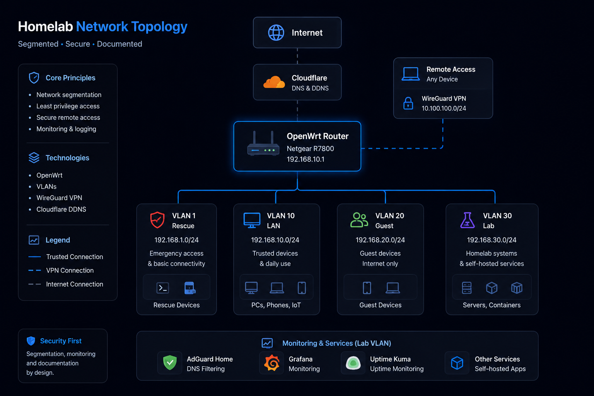

# Homelab Network Overview

## Network Topology

## Objective

This homelab was built to develop practical skills in:

* Networking
* Linux Administration
* Cybersecurity
* Virtualization
* Infrastructure Monitoring
* Network Security

The environment is designed to simulate a small enterprise network and serve as a platform for continuous learning and experimentation.

---

## Hardware

### Router

* Netgear R7800
* OpenWrt 24.10

### Server

* Fujitsu Esprimo Q7010
* Intel Core i5-10400T
* 32 GB RAM
* 256 GB NVMe SSD
* 1 TB External SSD

### Client Devices

* Windows PCs
* macOS Laptop
* iPhone
* IoT Devices

---

## Network Architecture

### VLAN 10 - LAN

Purpose: Trusted user devices

* Network: 192.168.10.0/24
* Gateway: 192.168.10.1

### VLAN 20 - Guest

Purpose: Isolated guest network

* Network: 192.168.20.0/24
* Internet access only

### VLAN 30 - Lab

Purpose: Virtualization and security lab

* Network: 192.168.30.0/24
* Planned services:

  * Proxmox
  * Docker
  * Grafana
  * Prometheus
  * Security Onion

### WireGuard VPN

Purpose: Secure remote access

* Network: 10.100.100.0/24
* Gateway: 10.100.100.1

---

## External Services

### Cloudflare

Used for:

* DNS Management
* Dynamic DNS
* VPN Endpoint Resolution

### VPN Endpoint

vpn.sterneborn.org
