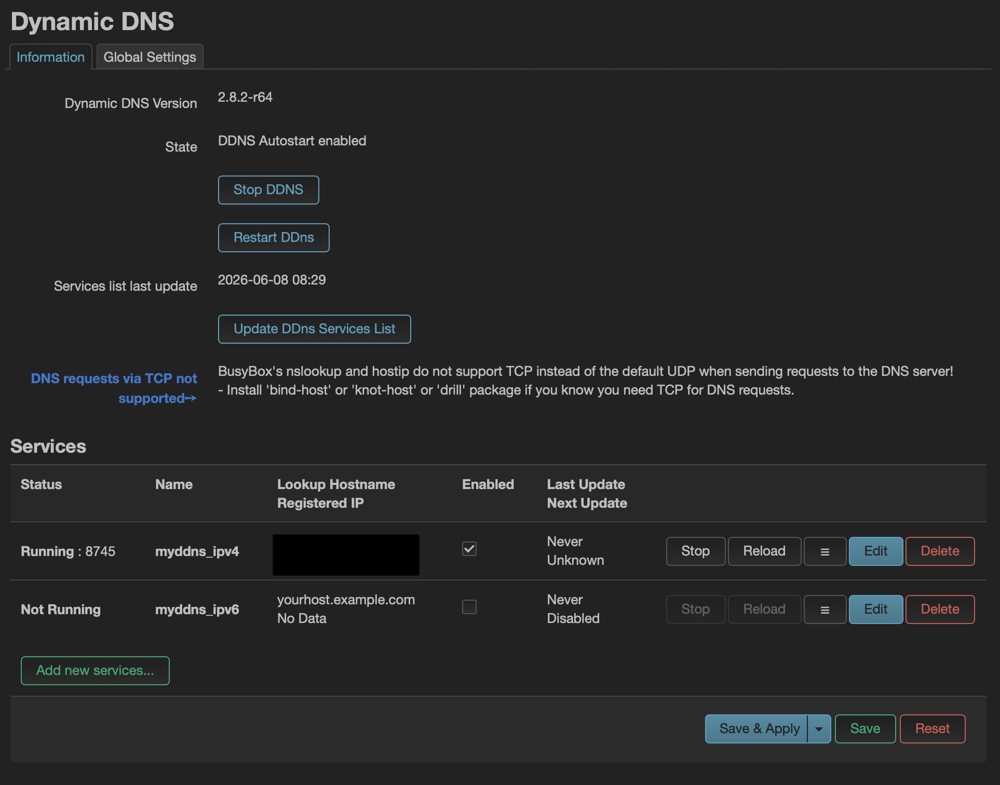

# Cloudflare Dynamic DNS

## OpenWrt-era Cloudflare DDNS Configuration



> **Architecture note:** The screenshot and package configuration on this page document the previous OpenWrt gateway. OpenWrt has since been replaced by UniFi; the stable-hostname design remains relevant to WireGuard remote access.

## Objective

The purpose of Dynamic DNS is to keep the VPN hostname updated when the public WAN IP address changes.

This allows WireGuard clients to connect using a stable domain name instead of a changing public IP address.

---

## DNS Provider

Cloudflare is used for:

* DNS management
* Dynamic DNS updates
* VPN endpoint resolution

---

## VPN Endpoint

```text
vpn.sterneborn.org
```

This hostname resolves to the public WAN IP used by the remote-access endpoint.

---

## Why Dynamic DNS Is Needed

The ISP can change the public IP address over time.

Without Dynamic DNS, WireGuard clients would fail to connect after an IP address change.

With Dynamic DNS:

```text
vpn.sterneborn.org
↓
Current WAN IP
↓
WireGuard Endpoint
```

---

## Previous OpenWrt Configuration

Installed packages:

```text
ddns-scripts
luci-app-ddns
ddns-scripts-services
ddns-scripts-cloudflare
```

DDNS service:

```text
cloudflare.com-v4
```

Lookup hostname:

```text
vpn.sterneborn.org
```

---

## Cloudflare Configuration

DNS record:

```text
Type: A
Name: vpn
Proxy status: DNS only
```

Important:

Cloudflare proxy must be disabled for WireGuard.

WireGuard uses UDP traffic, and the standard Cloudflare proxy does not proxy this traffic.

---

## API Token

A limited Cloudflare API token is used for Dynamic DNS updates.

Required permissions:

```text
Zone → DNS → Edit
Zone → Zone → Read
```

Scope:

```text
Specific zone: sterneborn.org
```

---

## Security Notes

The API token should be treated as sensitive information.

Never commit the token to GitHub.

Never include it in screenshots, backups, or public documentation.

---

## Verification

Useful commands:

```bash
nslookup vpn.sterneborn.org
```

```bash
wg show
```

```bash
logread | grep ddns
```

A working setup should show:

* DDNS updater running on the active platform
* Registered IP matching WAN IP
* WireGuard endpoint reachable through the domain name

The `logread` command and OpenWrt service checks above apply to the previous gateway and are retained as implementation history.

---

## Lessons Learned

Dynamic DNS solves the problem of changing residential IP addresses.

Using a domain name for VPN access is more reliable and professional than hardcoding a public IP address into client configurations.
