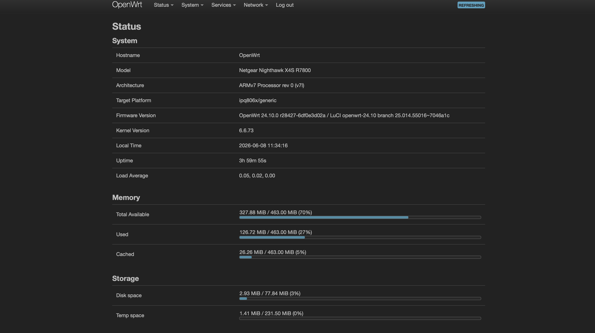

# OpenWrt Router Documentation

## OpenWrt Dashboard

## Overview

The router acts as the core network security and routing platform for the homelab.

### Platform

* Netgear R7800
* OpenWrt 24.10

---

## Security Features

Implemented security measures:

* HTTPS-only administration
* Strong administrator password
* VLAN segmentation
* Stateful firewall
* WireGuard VPN
* Cloudflare Dynamic DNS

---

## Network Segmentation

| VLAN    | Purpose         | Subnet          |
| ------- | --------------- | --------------- |
| VLAN 10 | Trusted LAN     | 192.168.10.0/24 |
| VLAN 20 | Guest Network   | 192.168.20.0/24 |
| VLAN 30 | Lab Environment | 192.168.30.0/24 |

---

## Installed Services

### VPN

* WireGuard

### Dynamic DNS

* Cloudflare DDNS

### Traffic Management

* SQM
* CAKE (planned)

---

## Backup Strategy

Router configuration backups are created after major configuration changes and stored both locally and in cloud storage.

---

## Lessons Learned

### Key Skills Developed

* VLAN deployment
* Firewall zoning
* VPN deployment
* DNS management
* OpenWrt administration
* Network troubleshooting
