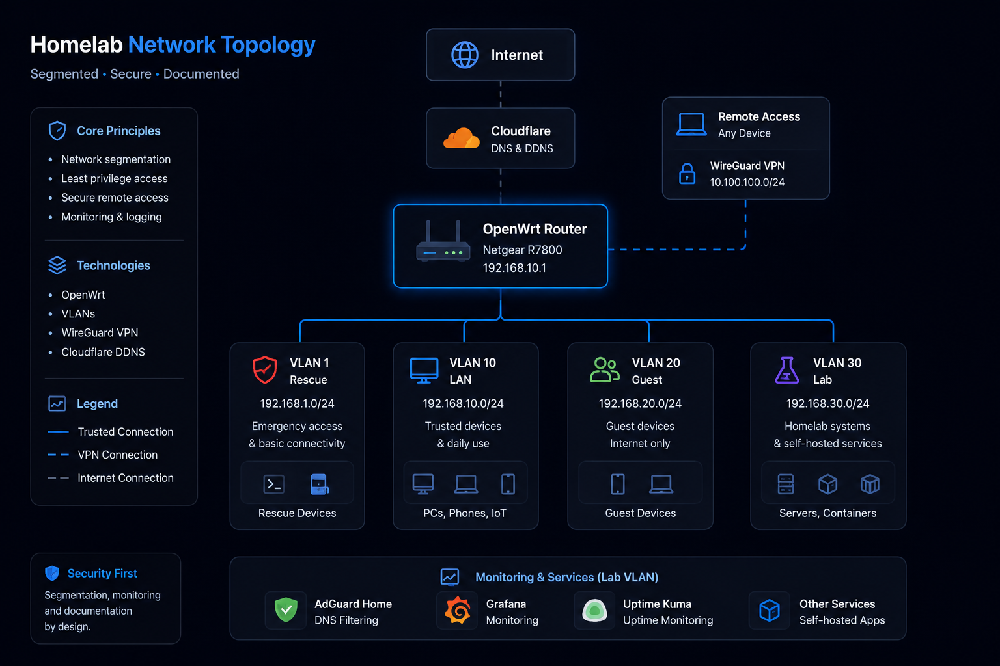

# OpenWrt — Previous Network Architecture

## Status

**Historical deployment — replaced by UniFi**

The Netgear R7800 and OpenWrt 24.10 platform was the homelab's earlier gateway, firewall, VPN, and Wi-Fi architecture. It has since been replaced by a [UniFi Cloud Gateway Ultra and UniFi-managed Wi-Fi](UniFi.md).

This page is intentionally retained because the OpenWrt phase documents important networking, security, and troubleshooting work that informed the current design.

---

## OpenWrt Dashboard

*Historical screenshot from the previous OpenWrt gateway.*

---

## Previous Platform

* Netgear R7800
* OpenWrt 24.10
* OpenWrt firewall zones
* Integrated Wi-Fi
* WireGuard
* Cloudflare Dynamic DNS

---

## Previous Segmentation

| VLAN | Purpose | Subnet |
| ---- | ------- | ------ |
| VLAN 10 | Trusted LAN | 192.168.10.0/24 |
| VLAN 20 | Guest Network | 192.168.20.0/24 |
| VLAN 30 | Lab Environment | 192.168.30.0/24 |

A separate recovery network was also maintained for emergency router access.

These identifiers and subnets describe the previous OpenWrt deployment, not the current UniFi configuration.

---

## Security and Network Features

The OpenWrt deployment included:

* HTTPS-only administration
* VLAN segmentation
* Stateful firewall zones
* WireGuard remote access
* Cloudflare Dynamic DNS
* DHCP and DNS integration with AdGuard Home
* Wi-Fi radio and SSID configuration

---

## Troubleshooting Experience

The platform was used for detailed investigation of Wi-Fi performance, radio assignments, WAN negotiation, SQM with CAKE, WireGuard peers, and firewall behavior. Testing each layer independently became a core troubleshooting method used across later projects.

---

## Migration to UniFi

The migration moved gateway, firewall, VLAN, and managed wireless responsibilities to the UniFi platform. The current design adds a dedicated IoT segment and expresses inter-network access through zone-based firewall policy.

The migration preserves the same core principles established with OpenWrt:

* Segment by trust and function
* Allow only required cross-network traffic
* Maintain secure remote access
* Validate changes through testing and logs
* Document both implementation and troubleshooting

---

## Skills Demonstrated

* OpenWrt administration
* VLAN deployment
* Firewall zoning
* WireGuard deployment
* DNS and DHCP integration
* Wi-Fi and network troubleshooting
* Migration planning and knowledge transfer
