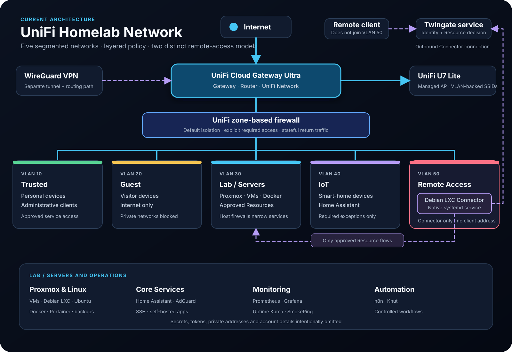

# UniFi Network

## Status

**Current network platform — operating.**

The homelab migrated from OpenWrt to a UniFi Cloud Gateway Ultra. The current platform centralizes routing, managed Wi-Fi, network definitions, and zone-based firewall policy.

## Current Components

* UniFi Cloud Gateway Ultra
* UniFi U7 Lite access point
* VLAN 10 — Trusted
* VLAN 20 — Guest
* VLAN 30 — Lab / Servers
* VLAN 40 — IoT
* VLAN 50 — Remote Access
* Dedicated Debian LXC Twingate Connector in VLAN 50

The access point maps wireless clients to the appropriate VLAN-backed network. Wired and virtual workloads are placed according to role and required trust.

!!! note "Current topology evidence"
    A current UniFi topology screenshot has not yet been added. The source-controlled architecture diagram above documents the intended current model without exposing device identifiers.

## Firewall Model

The gateway uses zone-based policies rather than treating internal networks as one trusted space. The operating intent is:

* permit established and related return traffic for connections that policy has already allowed,
* deny broad, unsolicited movement between zones,
* allow only the specific cross-zone flows required by an administered service,
* keep Guest internet-only,
* limit IoT integrations to documented exceptions,
* allow the Twingate Connector host to reach only approved internal Resources.

Stateful return traffic means a permitted connection can receive its response; it does not make the destination network generally open.

!!! note "Firewall evidence"
    A current UniFi zone-firewall screenshot is pending. Historical OpenWrt firewall screenshots are retained only on the OpenWrt documentation and are not presented as UniFi evidence.

## VLAN 50 and the Twingate Connector

VLAN 50 isolates the Connector from normal clients and server workloads. The Debian LXC runs the Connector as a native systemd service and initiates outbound connections to Twingate. No inbound internet port is opened for the Connector.

The first protected Resource is the Lab / Servers network. UniFi policy permits the Connector host to route to approved internal Resources, while host-level controls such as UFW can narrow access to allowed services. Home Assistant, SSH, and n8n are examples of services that have been allowed at the host layer.

Remote users are not placed in VLAN 50. Their client requests are evaluated by Twingate and relayed through the Connector to a Resource that may remain in VLAN 30.

See [Twingate Zero Trust Access](Twingate.md) for the full access flow.

## Wireless Design

The UniFi U7 Lite provides managed wireless access. SSIDs map clients into the correct network so that wireless convenience does not bypass segmentation. Guest and IoT devices remain subject to the same policy boundaries as their wired equivalents.

## Validation Approach

After a network or policy change:

1. Confirm the client is in the intended network.
2. Verify gateway and DNS reachability.
3. Test the intended flow and a representative denied flow.
4. Check gateway, host, and application evidence.
5. Confirm established return traffic works without opening unrelated access.
6. Record the result and a rollback path.

## Architecture History

OpenWrt was the previous routing and firewall platform. Its configuration notes and screenshots remain useful evidence of earlier VLAN, firewall, WireGuard, and troubleshooting work, but they do not represent current UniFi screens or policy.

## Related Documentation

* [Network Overview](../Network-Overview.md)
* [VLAN Segmentation](VLANs.md)
* [Twingate Zero Trust Access](Twingate.md)
* [WireGuard Remote Access](WireGuard.md)
* [OpenWrt — Previous Architecture](OpenWrt.md)
