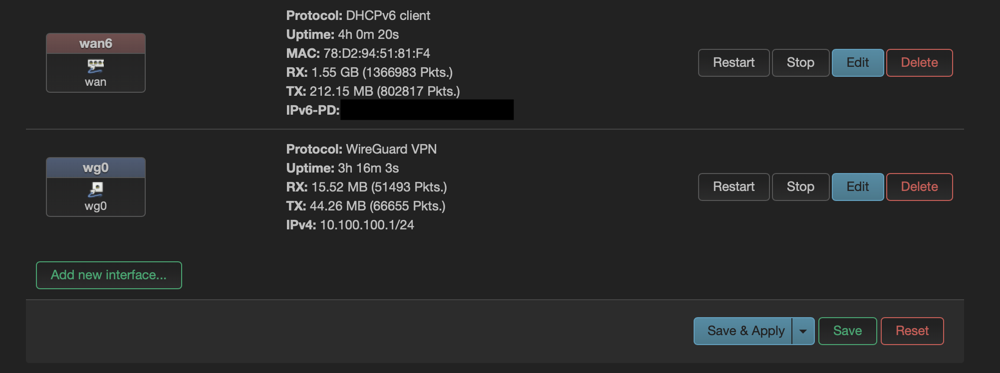

# WireGuard VPN Deployment

## WireGuard Interface

## Objective

Provide secure remote access to the homelab environment from external networks.

---

## VPN Configuration

### Server

Interface: wg0

* Address: 10.100.100.1/24
* Listen Port: UDP 51820

### Client

iPhone

* Address: 10.100.100.2

---

## DNS

VPN Endpoint:

vpn.sterneborn.org

Managed through Cloudflare Dynamic DNS.

---

## Firewall Configuration

WireGuard clients are permitted access to:

* LAN Network
* Lab Network
* Internet Gateway

---

## Troubleshooting Process

### Initial Problem

The VPN tunnel could not be established.

### Investigation

Used the following command:

wg show

Observed that no peer was loaded into the active WireGuard interface.

### Resolution

Verified peer configuration, reloaded the interface, and confirmed successful tunnel establishment.

### Verification

Successful handshake observed:

* Peer detected
* Traffic transmitted
* Traffic received
* Stable connection established

---

## Skills Demonstrated

* WireGuard deployment
* Firewall configuration
* Remote access design
* VPN troubleshooting
* OpenWrt administration
* Network diagnostics

---

## Future Improvements

* Additional VPN clients
* Multi-factor authentication
* Infrastructure monitoring
* VPN traffic analytics
* Security Onion integration
