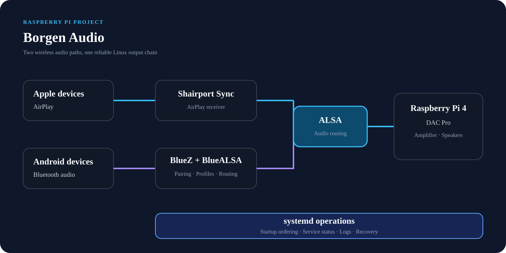

# Borgen Audio

## Overview

**Borgen Audio** is a Raspberry Pi 4 audio project that combines network streaming and Bluetooth playback through a dedicated DAC. The project required integration and troubleshooting across Linux services, audio routing, and Bluetooth.

---

## Hardware

* Raspberry Pi 4
* Raspberry Pi DAC Pro
* Existing amplifier and speaker setup

---

## Audio Sources

### AirPlay

AirPlay playback is provided by **Shairport Sync**, allowing Apple devices to stream audio to the Raspberry Pi and DAC.

### Android Bluetooth Audio

Android devices connect over Bluetooth. **BlueALSA** bridges Bluetooth audio into the ALSA audio stack so playback can reach the DAC.

---

## Troubleshooting Scope

Building a reliable appliance required investigation across several layers:

* `systemd` service startup, ordering, and logs
* ALSA device discovery and output selection
* BlueZ pairing, trust, reconnect, and profile behavior
* BlueALSA routing between Bluetooth and ALSA
* Shairport Sync output configuration
* Conflicts between audio services attempting to use the same device

The result is a useful example of structured troubleshooting: verify each layer independently, confirm the audio path end to end, and make the working state repeatable through service configuration.

---

## Skills Demonstrated

* Raspberry Pi administration
* Linux audio architecture
* AirPlay integration with Shairport Sync
* Bluetooth audio integration with BlueALSA and BlueZ
* ALSA device and routing diagnostics
* `systemd` service troubleshooting
