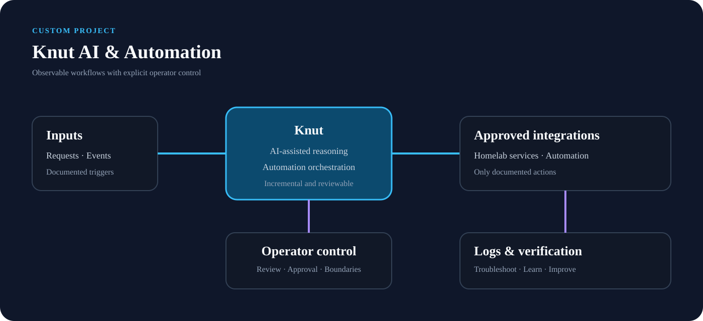

# Knut AI & Automation

## Overview

Knut is a major custom AI and automation project within the homelab. It is an ongoing practical environment for exploring how AI-assisted workflows can interact with self-hosted services and repeatable automation while remaining observable and under operator control.

---

## Project Focus

The project emphasizes:

* Custom AI-assisted workflows
* Automation of repeatable tasks
* Integration with homelab services
* Clear operator control and review
* Logging, troubleshooting, and iterative improvement
* Documentation of design decisions and lessons learned

---

## Engineering Approach

Knut is treated as a real infrastructure project rather than a one-off experiment. Changes are tested incrementally, failures are investigated through logs and service state, and useful workflows are documented so they can be reproduced and improved.

The project also provides a place to evaluate where automation is genuinely useful and where a human decision should remain part of the workflow.

---

## Skills Demonstrated

* AI workflow design
* Systems integration
* Automation engineering
* Operational troubleshooting
* Iterative development
* Technical documentation
