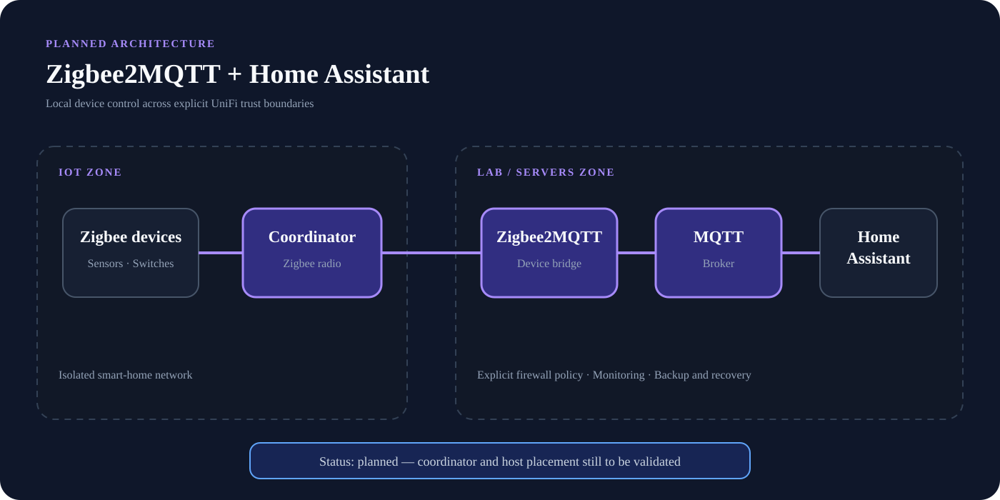

# Planned Zigbee2MQTT Architecture

## Status

**Planned — not yet presented as a deployed service.**

The next smart-home expansion is a dedicated Zigbee coordinator with Zigbee2MQTT, integrated with Home Assistant while keeping IoT devices in their own network segment.



---

## Planned Data Path

```text
Zigbee devices
      |
Zigbee coordinator
      |
Zigbee2MQTT
      |
MQTT broker
      |
Home Assistant
```

---

## Design Goals

* Keep Zigbee device communication local
* Avoid unnecessary dependence on vendor cloud services
* Provide Home Assistant with a consistent MQTT integration point
* Separate IoT devices from Trusted and Lab/Servers clients
* Make coordinator, broker, and application health observable
* Document pairing, backup, recovery, and troubleshooting procedures

---

## Network and Security Model

The design will use the IoT zone for smart-home devices and explicit firewall policy for any required traffic toward Home Assistant or supporting services. The coordinator and Zigbee2MQTT host placement will be selected with radio reliability, USB access, maintainability, and recovery in mind.

---

## Planned Validation

* Coordinator detection and stable radio operation
* MQTT message flow between Zigbee2MQTT and the broker
* Home Assistant discovery and device control
* IoT isolation and required cross-zone exceptions
* Backup and restore of coordinator and Zigbee2MQTT state
* Monitoring for unavailable devices and services
