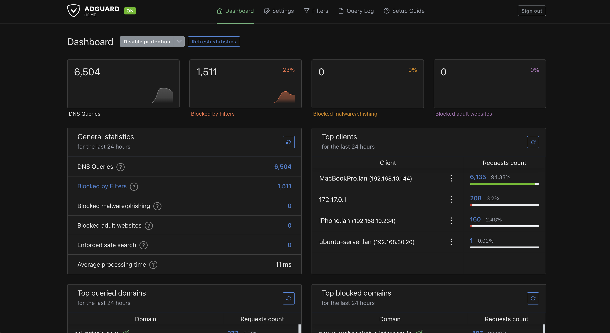
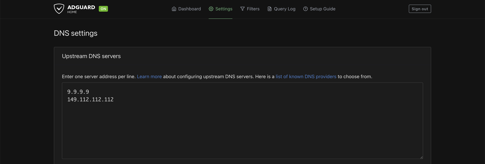
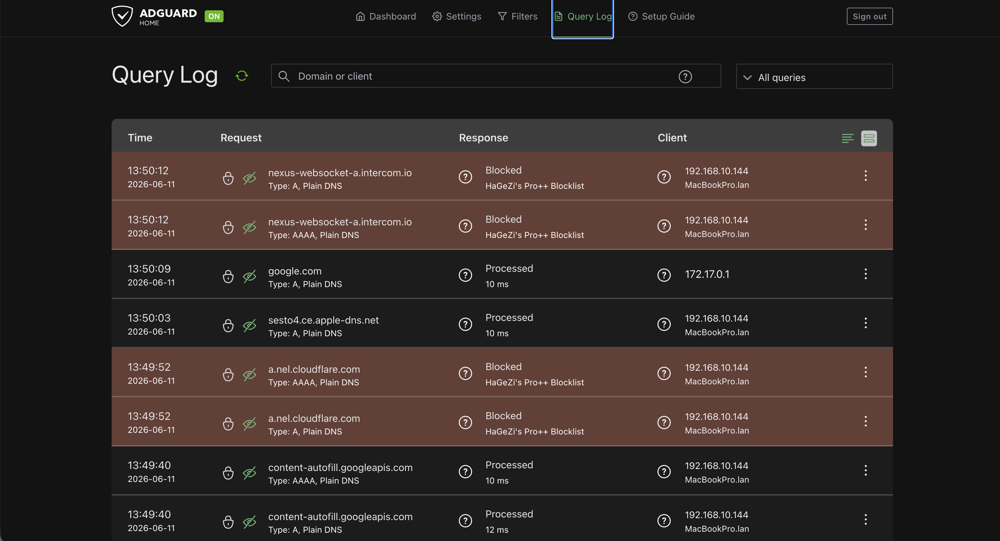

# AdGuard Home

## Overview

AdGuard Home was deployed as a network-wide DNS filtering solution within the homelab environment.

The primary goal was to gain hands-on experience with DNS infrastructure while improving privacy, reducing unwanted content, and introducing centralized DNS management for all devices on the network.

AdGuard Home was the first production service integrated with the homelab network and remains part of the current service stack. DHCP and network policy are now managed through UniFi.

---

## Objectives

The following objectives were defined before deployment:

* Learn DNS fundamentals
* Deploy a network-wide DNS filtering service
* Improve privacy and reduce unwanted content
* Gain experience troubleshooting containerized services
* Integrate DNS services with the segmented network

---

## Environment

### Host Platform

AdGuard Home is deployed as a Docker container on:

* Ubuntu Server
* Running on Proxmox VE
* Connected to the Lab/Servers network

The service is made available to approved clients through DHCP-provided DNS settings and zone-based policy managed on the UniFi gateway.

---

## Deployment

AdGuard Home was deployed as a Docker container and configured to listen on DNS port 53.

The deployment required additional troubleshooting before becoming operational because another service was already using port 53 on the Ubuntu Server virtual machine.

The issue was traced to `systemd-resolved`, which was binding to the local DNS port and preventing Docker from starting the AdGuard Home container.

After identifying the conflict, the service was reconfigured and AdGuard Home was successfully deployed.

---

## Dashboard Overview

The AdGuard Home dashboard provides visibility into DNS activity, blocked requests, client statistics and service health.



The dashboard allows monitoring of:

* Total DNS requests
* Blocked requests
* Active clients
* Top queried domains
* DNS performance

This provides immediate visibility into network DNS activity.

---

## DNS Configuration

AdGuard Home was configured to use upstream DNS providers while serving as the primary DNS resolver for network clients.



The service receives DNS queries from client devices and forwards approved requests to upstream resolvers.

This architecture allows DNS filtering while maintaining normal internet connectivity.

---

## DNS Verification

Successful deployment was verified using command-line testing.

Example verification:

```bash
dig @192.168.30.20 google.com
```

Responses confirmed that DNS queries were successfully processed through AdGuard Home.

The Query Log provides additional verification by displaying DNS requests received from network clients.



This confirmed that devices on the network were actively using AdGuard Home as their DNS server.

---

## Network Integration

The current UniFi network advertises AdGuard Home to the client networks that use it. Zone-based policies allow DNS traffic without granting broad access between Trusted, Guest, Lab/Servers, and IoT networks.

During the original deployment, OpenWrt DHCP settings were updated to advertise AdGuard Home as the primary DNS server. That implementation is retained here as migration history.

Clients automatically received the new DNS configuration when renewing DHCP leases.

This allowed DNS filtering to be applied across the entire network without requiring manual configuration on individual devices.

---

## Benefits of AdGuard Home

AdGuard Home provides several advantages:

* Centralized DNS management
* Network-wide content filtering
* Reduced advertising and tracking
* Improved visibility into DNS activity
* Local control over DNS policies

The service also provides practical experience with DNS infrastructure and troubleshooting.

---

## Verification

The following tests were performed:

* Verify container deployment
* Verify DNS port accessibility
* Verify DNS resolution
* Verify DHCP integration
* Verify client connectivity
* Verify query logging
* Verify filtering functionality

Successful completion of these tests confirmed that AdGuard Home was operational and integrated into the network.

---

## Troubleshooting Methodology

Several issues were encountered during deployment.

### Port 53 Conflict

Docker initially failed to start the AdGuard Home container because DNS port 53 was already in use.

Investigation revealed that `systemd-resolved` was binding to the required port.

The issue was identified using:

```bash
sudo ss -tulpn | grep :53
```

The service was then reconfigured, allowing AdGuard Home to successfully bind to the DNS port.

### DNS Testing

DNS functionality was verified using:

```bash
dig @192.168.30.20 google.com
```

This confirmed that queries were successfully processed by AdGuard Home.

---

## Lessons Learned

The deployment of AdGuard Home provided practical experience with:

* DNS infrastructure
* DNS troubleshooting
* Docker networking
* Port binding conflicts
* DHCP integration
* UniFi DHCP and firewall integration
* OpenWrt administration during the original deployment
* Network-wide service deployment

The project reinforced the importance of structured troubleshooting and verification when deploying infrastructure services.

AdGuard Home now serves as the primary DNS platform within the homelab and provides a foundation for future monitoring and security projects.
