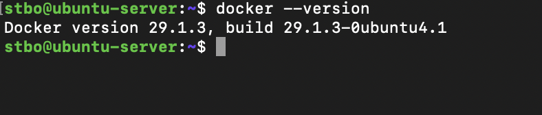
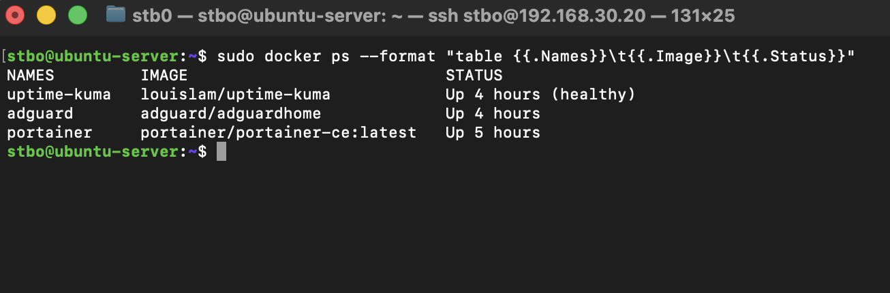

# Docker

## Overview

Docker was introduced as the primary containerization platform within the homelab environment.

The goal of deploying Docker was to simplify service deployment, improve workload isolation, and gain practical experience with containerized infrastructure commonly used in modern enterprise environments.

Docker serves as the foundation for several infrastructure services running within the homelab, including Portainer, AdGuard Home, and Uptime Kuma.

---

## Objectives

The following objectives were defined before deployment:

* Learn containerization fundamentals
* Deploy infrastructure services efficiently
* Simplify application management
* Improve service portability
* Support future monitoring and security projects

---

## Environment

### Host Platform

Docker is deployed on:

* Ubuntu Server
* Running as a virtual machine on Proxmox VE
* Connected to VLAN 30 (Lab Network)

This architecture provides separation between the physical host, virtual machine, and application services.

---

## Docker Installation

Docker Engine was installed on Ubuntu Server using the official Docker repositories.

After installation, the Docker service was verified and configured to start automatically during system boot.

The installation provides a platform for deploying and managing containerized applications without requiring additional virtual machines.

---

## Docker Installation Verification

Docker Engine was successfully installed and verified on the Ubuntu Server virtual machine.



Verification confirmed that Docker was installed correctly and available through the command-line interface.

---

## Running Containers

Docker currently hosts multiple infrastructure services used throughout the homelab environment.



At the time of documentation, the following services were deployed as Docker containers:

* Portainer
* AdGuard Home
* Uptime Kuma

Additional services will be added as the homelab expands into monitoring and security operations.

---

## Docker Architecture

The current service architecture is:

```text
Proxmox VE
    │
Ubuntu Server VM
    │
Docker Engine
    ├── Portainer
    ├── AdGuard Home
    └── Uptime Kuma
```

This design allows infrastructure services to be deployed independently while sharing the same operating system environment.

---

## Benefits of Docker

The use of Docker provides several advantages:

* Rapid service deployment
* Simplified upgrades
* Service isolation
* Consistent application environments
* Reduced resource consumption
* Improved portability

Compared to deploying individual virtual machines for every service, Docker allows multiple applications to run efficiently while sharing system resources.

---

## Verification

The following tests were performed:

* Verify Docker installation
* Verify Docker daemon functionality
* Deploy containers
* Verify container networking
* Verify service accessibility
* Verify container persistence across reboots

Successful completion of these tests confirmed that Docker was operational and ready to host infrastructure services.

---

## Troubleshooting Methodology

When troubleshooting Docker-related issues, the following process is used:

1. Verify Docker service status
2. Verify container status
3. Review container logs
4. Verify network connectivity
5. Verify port mappings
6. Verify volume mounts
7. Restart affected containers if necessary

Common diagnostic commands:

```bash
docker ps
```

```bash
docker logs <container>
```

```bash
docker inspect <container>
```

```bash
docker restart <container>
```

---

## Lessons Learned

Docker introduced a different deployment model compared to traditional virtual machines.

Learning how containers, images, networks, and volumes interact provided valuable experience with modern infrastructure management practices.

Docker significantly simplifies service deployment and maintenance while reducing resource consumption compared to running separate virtual machines for each application.

The platform now serves as the foundation for infrastructure services throughout the homelab and will support future monitoring and security tooling.
