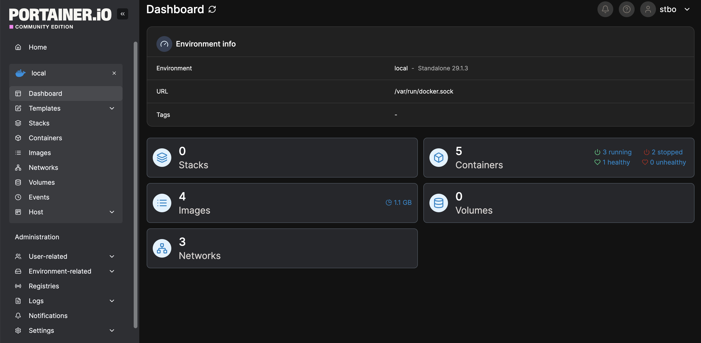
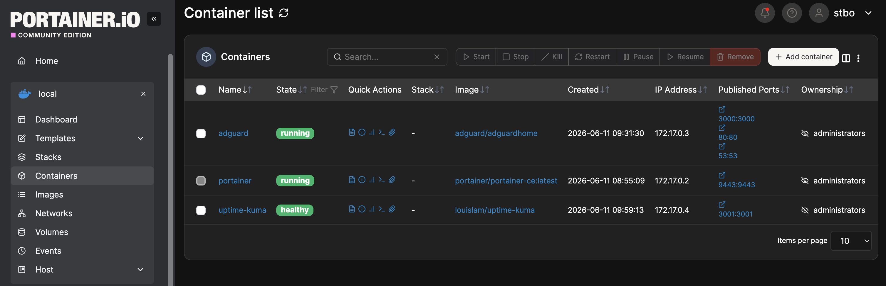

# Portainer

## Overview

Portainer was deployed to simplify Docker management within the homelab environment.

While Docker can be managed entirely from the command line, Portainer provides a centralized web-based interface for managing containers, images, networks, volumes, and Docker environments.

The deployment of Portainer improved visibility into the container platform and simplified day-to-day administration.

---

## Objectives

The following objectives were defined before deployment:

* Learn container management platforms
* Simplify Docker administration
* Improve visibility into running services
* Reduce reliance on command-line management
* Support future infrastructure growth

---

## Environment

### Host Platform

Portainer is deployed as a Docker container on:

* Ubuntu Server
* Running on Proxmox VE
* Connected to VLAN 30 (Lab Network)

Portainer manages the local Docker environment used throughout the homelab.

---

## Deployment

Portainer was deployed as a Docker container and configured to start automatically after system reboots.

The service provides a secure web interface for managing Docker resources and monitoring container status.

After deployment, connectivity and functionality were verified through the web interface.

---

## Dashboard Overview

The Portainer dashboard provides a centralized view of the Docker environment.



The dashboard provides visibility into:

* Containers
* Images
* Networks
* Volumes
* Docker environment health

This interface simplifies infrastructure administration and provides quick access to operational information.

---

## Container Management

Portainer is used to manage all infrastructure containers currently deployed within the homelab.



At the time of documentation, Portainer manages:

* Portainer
* AdGuard Home
* Uptime Kuma

Additional services will be added as the homelab expands.

---

## Benefits of Portainer

Portainer provides several advantages compared to managing Docker exclusively through the command line:

* Centralized administration
* Simplified container management
* Improved visibility
* Easier troubleshooting
* Faster deployment workflows
* Reduced administrative complexity

The platform allows infrastructure services to be monitored and managed from a single interface.

---

## Verification

The following tests were performed:

* Verify Portainer deployment
* Verify web interface accessibility
* Verify Docker environment connectivity
* Verify container visibility
* Verify container management functionality
* Verify service persistence across reboots

Successful completion of these tests confirmed that Portainer was operational and capable of managing the Docker environment.

---

## Troubleshooting Methodology

When troubleshooting Portainer-related issues, the following process is used:

1. Verify Docker service status
2. Verify Portainer container status
3. Verify web interface accessibility
4. Review Portainer logs
5. Verify Docker environment connectivity
6. Restart affected services if necessary

Common diagnostic commands:

```bash
docker ps
```

```bash
docker logs portainer
```

```bash
docker restart portainer
```

---

## Lessons Learned

Portainer provides a practical introduction to container management platforms commonly used in modern infrastructure environments.

The platform simplifies administration while improving visibility into containerized services.

Deploying Portainer also reinforced understanding of Docker containers, networking, persistent storage, and service management.

Portainer now serves as the primary interface for managing containerized infrastructure throughout the homelab.
