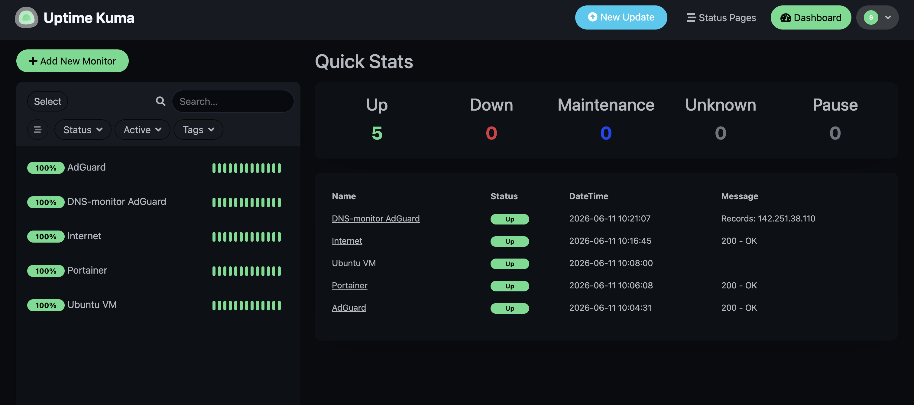

# Uptime Kuma

## Overview

Uptime Kuma was deployed as the first monitoring platform within the homelab environment.

The primary goal was to gain hands-on experience with infrastructure monitoring while improving visibility into service availability and system health.

The platform provides real-time monitoring of critical infrastructure services and generates a centralized view of operational status.

---

## Objectives

The following objectives were defined before deployment:

* Learn monitoring fundamentals
* Track service availability
* Improve infrastructure visibility
* Detect service outages quickly
* Prepare for future observability platforms

---

## Environment

### Host Platform

Uptime Kuma is deployed as a Docker container on:

* Ubuntu Server
* Running on Proxmox VE
* Connected to VLAN 30 (Lab Network)

The service monitors infrastructure components deployed throughout the homelab environment.

---

## Deployment

Uptime Kuma was deployed as a Docker container and configured to start automatically during system boot.

After deployment, connectivity and monitoring functionality were verified through the web interface.

The service became the first dedicated monitoring platform within the homelab.

---

## Monitoring Dashboard

The Uptime Kuma dashboard provides a centralized overview of monitored services and their operational status.



The dashboard displays:

* Service availability
* Monitor status
* Response times
* Historical uptime information
* Infrastructure health

This provides immediate visibility into the state of the homelab environment.

---

## Monitored Services

At the time of documentation, Uptime Kuma monitors:

* Ubuntu Server
* Portainer
* AdGuard Home
* Internet connectivity

Additional monitors will be added as the infrastructure expands.

---

## Benefits of Uptime Kuma

Uptime Kuma provides several advantages:

* Real-time service monitoring
* Infrastructure visibility
* Fast outage detection
* Historical availability tracking
* Simple deployment and administration

The platform serves as an introduction to monitoring concepts that will later be expanded through Prometheus and Grafana.

---

## Verification

The following tests were performed:

* Verify container deployment
* Verify web interface accessibility
* Create monitoring checks
* Verify monitor status updates
* Verify service reachability
* Verify persistence across reboots

Successful completion of these tests confirmed that Uptime Kuma was operational and monitoring infrastructure services correctly.

---

## Troubleshooting Methodology

When monitoring issues occur, the following process is used:

1. Verify container status
2. Verify network connectivity
3. Verify monitor configuration
4. Verify target service availability
5. Review container logs
6. Restart affected services if necessary

Common diagnostic commands:

```bash
docker ps
```

```bash
docker logs uptime-kuma
```

```bash
docker restart uptime-kuma
```

---

## Lessons Learned

The deployment of Uptime Kuma introduced practical monitoring concepts and provided valuable visibility into the health of infrastructure services.

Monitoring availability, response times and service status reinforced the importance of observability in modern infrastructure environments.

Uptime Kuma now serves as the foundation for future monitoring initiatives and prepares the environment for the introduction of Prometheus, Grafana and alerting workflows.
