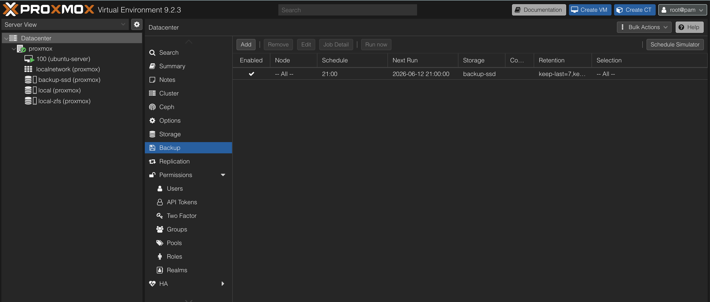

# Backup Strategy

## Overview

A reliable backup strategy is essential for maintaining infrastructure stability while allowing experimentation and continuous learning.

The homelab uses a layered recovery approach consisting of:

* Proxmox snapshots for rapid rollback
* Automated virtual machine backups
* Dedicated external backup storage
* Technical documentation for rebuild and recovery procedures

This approach reduces deployment risk and provides multiple recovery options in the event of system failures, configuration mistakes, or unsuccessful deployments.

---

## Objectives

The backup strategy was designed to achieve the following goals:

* Protect critical infrastructure services
* Reduce deployment risk
* Minimize recovery time
* Support safe experimentation
* Enable rapid rollback
* Maintain recoverable backups of virtual machines
* Follow enterprise-inspired backup practices

---

## Backup Infrastructure

### Backup Repository

A dedicated external SSD is used as the primary backup repository.

Hardware:

* Kingston XS2000 1 TB SSD

Storage Configuration:

* GPT partition table
* ext4 filesystem
* Mounted at `/backup`
* Automatically mounted through `/etc/fstab`
* Integrated into Proxmox as storage `backup-ssd`

Separating backup storage from the primary virtualization storage improves resilience and provides protection against virtual machine corruption or accidental data loss.

---

## Automated Backup Jobs

A scheduled backup job has been configured within Proxmox to automatically protect critical virtual machines.



Configuration:

* Storage: backup-ssd
* Backup Mode: Snapshot
* Compression: ZSTD
* Automated execution
* Retention policy managed by Proxmox

Automated backups ensure recovery points are created regularly without requiring manual intervention.

---

## Snapshot Strategy

Proxmox snapshots are used before major infrastructure changes.

Snapshots are created before:

* New service deployments
* Major configuration changes
* Network modifications
* Monitoring deployments
* Security tool installations

This allows rapid rollback to a known working state if a deployment introduces instability or unexpected behavior.

---

## Snapshot Management

The Proxmox snapshot interface provides a simple method for managing recovery points.


Example naming conventions:

```text
adguard-working
adguard-production
docker-monitoring-working
```

Using descriptive snapshot names makes it easier to identify stable recovery points during troubleshooting and recovery operations.

---

## Backup Verification

A manual backup of the Ubuntu Server virtual machine was performed to verify the backup infrastructure.

Backup Details:

* VM ID: 100
* VM Name: ubuntu-server
* Backup Mode: Snapshot
* Compression: ZSTD
* Backup Repository: backup-ssd

Results:

* Virtual Disk Size: 40 GB
* Backup File Size: 2.94 GB
* Backup Completed Successfully
* Backup Archive Verified on External Storage

The backup file was verified by confirming the successful creation of the archive within the backup repository.

---

## Recovery Process

If a deployment fails, the following recovery process is used:

1. Stop additional configuration changes.
2. Identify the last known working snapshot or backup.
3. Restore the selected recovery point.
4. Verify system functionality.
5. Review the failed deployment.
6. Reattempt deployment if required.

This process significantly reduces downtime and simplifies troubleshooting.

---

## Planned Recovery Testing

A backup is only considered fully validated after successful restoration testing.

Planned validation includes:

* Restoring a backup to a separate virtual machine
* Verifying successful system boot
* Verifying network connectivity
* Verifying service functionality
* Documenting the recovery procedure

This testing process follows enterprise backup validation practices and ensures that backups can be successfully restored when required.

---

## Documentation as Recovery

Technical documentation is treated as an additional recovery mechanism.

Documentation includes:

* Installation procedures
* Service configurations
* Network architecture
* Troubleshooting notes
* Verification procedures

By combining backups, snapshots, and documentation, infrastructure can be rebuilt even if recovery from a backup is not possible.

---

## Enterprise Concepts Practiced

This project provided practical experience with:

* Backup repository management
* Filesystem provisioning
* Automated backup scheduling
* Snapshot-based recovery
* Backup verification
* Recovery planning
* Infrastructure documentation

These concepts are commonly used in enterprise infrastructure and systems administration environments.

---

## Lessons Learned

Implementing dedicated backup storage significantly improves infrastructure resilience.

Combining snapshots with automated virtual machine backups provides multiple recovery options and reduces operational risk when deploying new technologies.

The introduction of scheduled backups represents an important step toward enterprise-style infrastructure management and operational maturity within the homelab environment.
