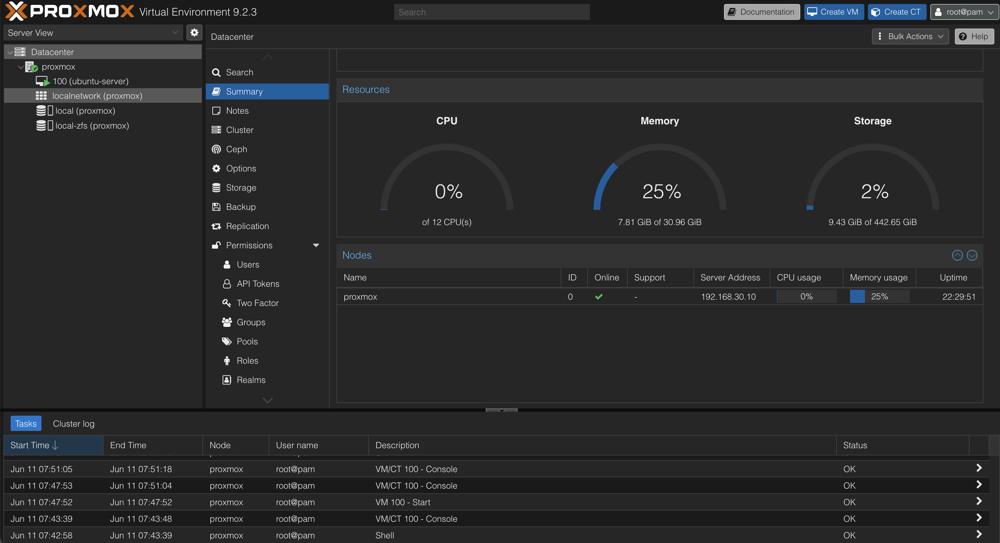
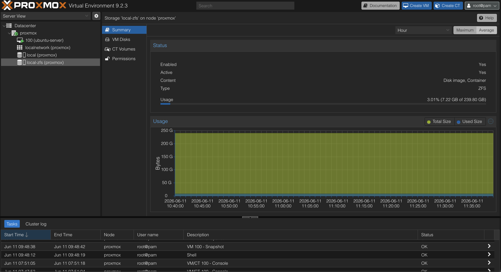
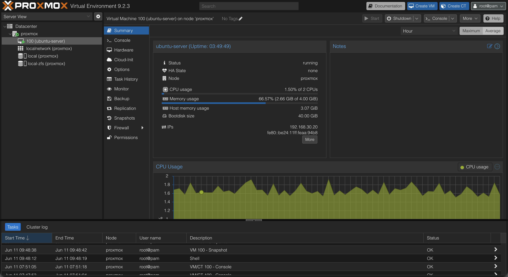

# Proxmox VE

## Overview

Proxmox VE was deployed as the primary virtualization platform for the homelab environment.

The purpose of introducing virtualization was to separate infrastructure services from physical hardware, simplify management, enable rapid recovery through snapshots, and provide hands-on experience with enterprise virtualization technologies.

---

## Objectives

The following objectives were defined before deployment:

* Learn virtualization fundamentals
* Create isolated environments for infrastructure services
* Enable snapshot-based recovery
* Simplify service deployment
* Support future monitoring and security projects

---

## Hardware

### Host System

* Fujitsu Esprimo Q7010
* 32 GB RAM
* NVMe SSD
* Proxmox VE

The system serves as the dedicated virtualization host for the homelab environment.

---

## Proxmox Host Overview

The Proxmox summary dashboard provides an overview of resource utilization, storage capacity, uptime, and overall system health.

> **Screenshot context:** The Proxmox screenshots document the deployed platform at the time of capture. Resource values, VM state, and interface details are point-in-time evidence rather than a live inventory.



This dashboard is used to monitor:

* CPU utilization
* Memory consumption
* Storage usage
* System uptime
* Host status

The summary page provides a quick assessment of the health and performance of the virtualization platform.

---

## Storage Configuration

During installation, ZFS was selected as the primary storage backend.

### Why ZFS?

* Native snapshot support
* Data integrity verification
* Fast rollback capability
* Enterprise-grade storage features
* Well suited for virtualization workloads

Current storage pool:

```text
rpool
```

Pool status:

```text
ONLINE
```

---

## ZFS Storage Pool

The ZFS storage pool is responsible for storing virtual machine disks, snapshots, and Proxmox data.



ZFS provides several advantages compared to traditional filesystems:

* Instant snapshots
* Data corruption detection
* Efficient storage management
* Simplified recovery procedures

These features reduce risk when deploying new services and experimenting with infrastructure changes.

---

## Virtual Machines

Virtual machines allow workloads to be isolated from the physical host while sharing hardware resources.

### Ubuntu Server

The Ubuntu Server virtual machine serves as the primary infrastructure host.



Current responsibilities:

* Docker host
* Portainer
* AdGuard Home
* Uptime Kuma

Home Assistant and other projects integrate with the wider homelab, but their placement is not inferred from this original VM screenshot.

This VM acts as the foundation for most services deployed within the homelab.

---

## Initial Configuration

After installation, the following tasks were completed:

* Management network configured
* Web interface verified
* SSH access verified
* System updates installed
* ZFS storage verified
* Ubuntu Server virtual machine deployed

---

## Verification

The following tests were performed:

* Access Proxmox web interface
* Verify host network connectivity
* Verify ZFS storage pool status
* Deploy Ubuntu Server virtual machine
* Verify VM connectivity
* Verify SSH access

Successful completion of these tests confirmed that the virtualization platform was operational and ready for service deployment.

---

## Snapshot Strategy

Snapshots are created before:

* New service deployments
* Major configuration changes
* Monitoring deployments
* Security tooling installations
* Infrastructure modifications

Examples:

* adguard-working
* adguard-production
* docker-monitoring-working

Snapshots provide a reliable rollback mechanism if a deployment introduces instability or unexpected behavior.

---

## Lessons Learned

Virtualization significantly simplifies infrastructure management and experimentation.

Proxmox provides an enterprise-style platform for hosting services while maintaining workload isolation.

The combination of Proxmox and ZFS enables rapid recovery through snapshots, making it possible to safely test new technologies without risking the stability of the overall environment.
