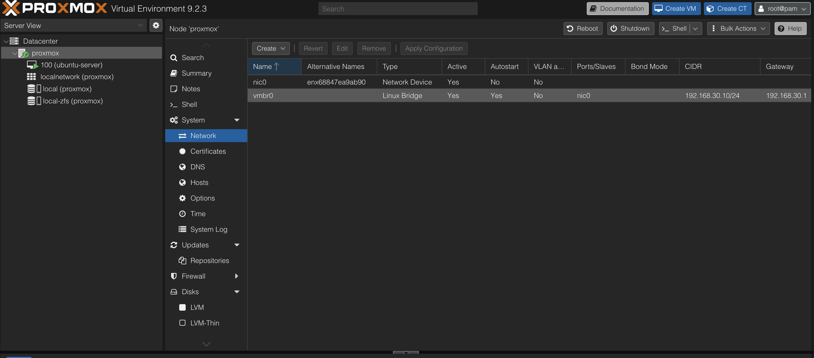
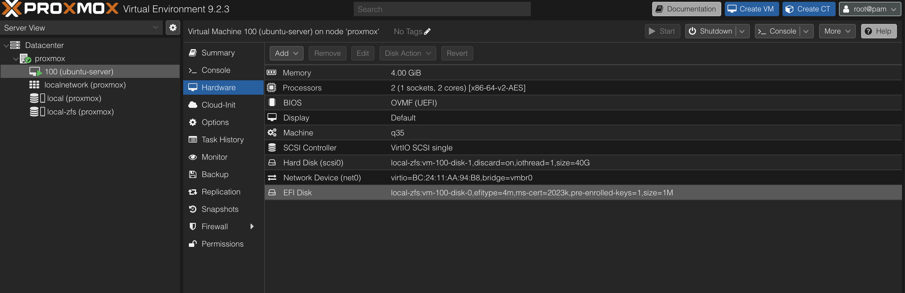
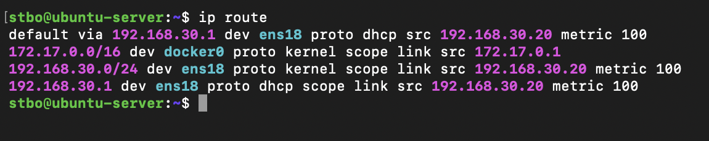

# Virtual Networking

## Overview

Virtual networking enables communication between virtual machines, the Proxmox host, and the physical network.

In this homelab, virtual networking allows services running inside virtual machines to communicate through the Lab/Servers network while maintaining the segmentation and zone-based policies configured on the UniFi Cloud Gateway Ultra.

---

## Objectives

The following objectives were defined for the virtual networking design:

* Provide network connectivity for virtual machines
* Maintain VLAN segmentation
* Support infrastructure services
* Support future monitoring and security tooling
* Simulate enterprise-style virtualization environments

---

## Network Architecture

The current network path is:

```text
Internet
    │
UniFi Cloud Gateway Ultra
    │
Lab/Servers VLAN
    │
Proxmox Host
    │
vmbr0 Linux Bridge
    │
Ubuntu Server VM
    │
Docker Services
```

This architecture allows virtual machines to communicate with the physical network as if they were directly connected to a switch.

---

## Proxmox Network Bridge

Proxmox uses a Linux bridge named:

```text
vmbr0
```

The bridge connects the physical network adapter to virtual machines running on the host.



The bridge acts similarly to a Layer 2 switch and allows virtual machines to access the network without requiring additional routing configuration.

### Benefits

* Simplified VM networking
* Layer 2 connectivity
* VLAN compatibility
* Enterprise-standard architecture

---

## Ubuntu Virtual Machine Network Configuration

The Ubuntu Server virtual machine is connected to the Proxmox bridge through a virtual network adapter.



The virtual network adapter is attached to the `vmbr0` bridge, allowing the virtual machine to communicate on the Lab/Servers network.

---

## Network Verification

Network connectivity was verified from the Ubuntu Server virtual machine.



The screenshot records the initial OpenWrt-era deployment and confirms:

* Ubuntu Server IP address: `192.168.30.20`
* Default gateway: `192.168.30.1`
* Connectivity to the original Lab network
* Docker network availability (`172.17.0.0/16`)

Successful verification confirmed:

* DHCP functionality
* Gateway reachability
* Network routing
* Internet connectivity
* Remote administration capability

---

## Troubleshooting Methodology

When network issues occur, the following process is used:

1. Verify virtual machine status
2. Verify network adapter configuration
3. Verify bridge configuration (`vmbr0`)
4. Verify IP address assignment
5. Verify default gateway
6. Verify VLAN configuration
7. Verify firewall policies

Common diagnostic commands:

```bash
ip addr
```

```bash
ip route
```

```bash
ping 192.168.30.1
```

```bash
ping 8.8.8.8
```

---

## Lessons Learned

Virtual networking behaves similarly to physical switching and is a fundamental concept in enterprise infrastructure.

Understanding bridges, virtual adapters, routing, and VLAN integration is essential when deploying services in virtualized environments.

The Proxmox bridge architecture provides a simple and reliable method for integrating virtual machines into the current network while the UniFi gateway enforces segmentation between zones.

The recorded `192.168.30.0/24` addressing is retained as historical deployment evidence and should not be read as a public specification of the current VLAN address plan.
